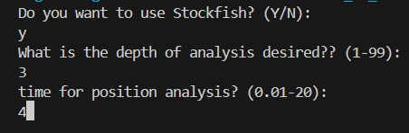

# Trabalho_A1_LP

by Adriel Dias, Gabriel Schuenker, Gustavo Luciano, João Vitor Resende


## About the project 

In this work, we developed research on a [database of chess games](https://www.kaggle.com/datasets/datasnaek/chess), available at kaggle.com. The research seeks to confirm or refute previously raised hypotheses. The main libraries used in this project was pandas, numpy, matplotlib, seaborn, chess and stockfish.


## About the dataset

As previously mentioned, the data set contains chess games played at https://lichess.org. This database contains more than twenty thousand lines and sixteen columns about the respective games.


## Project directories

* **data**: Contains the data used and generated by the project.

* * **docs**: Contains the files of the analysis made based on this project.

* **graphs**: Contains the graphs generated in the project.

* **src**: The source directory, contains most of the project functions.

* **tests**: Test directory, used to test the functions of **src**.


 ## Installing this project

 First of all, be sure you have installed compatible versions of the libraries used. The versions we used are available in `requirements.txt`


 ```python

    pip install -r requirements.txt

```


Then you can clone the repository

```bash

   git clone https://github.com/ADrielFariads/Trabalho_A1_LP.git

```


### Stockfish configuration

After that, you have to choose whether you want to use stockfish's engine or not. If so, you need to insert the path to the stockfish executable file in the location indicated in `src/Constants.py`.

More formal information about stockfish can be found at [Stockfish Official Documentation](https://github.com/official-stockfish/Stockfish/blob/master/README.md).


## Using the project

Once you have installed and cloned the repository, you can run the `main.py` file.

```bash

python main.py

```


### Stockfish use


If you are going to use the stockfish's engine, choose the depth of the engine's analisys.




It should be noted that as it is an external program, the results may differ from the analysis carried out in the first instance. If you run a new Stockfish 's analysis, the data and graphs generateds may slightly differ from the original ones. Furthermore, realize that the engine analysis has exponential complexity in relation to depth, which means that a small increase in depth drastically increases the program's response time. You can check the number of games already analyzed by the counter in the terminal.


## Result

Once executed, `main.py` generates the graphs used in the analysis of the work and updates the dataset with the changes made. the graphs can be found in the `graphs` folder, while the resulting dataframe will be in the `data` folder. We remind you once again that, if you performed a new analysis of stockfish, the data returned may differ from that found in the `graphs` and, consequently, result in different graphs.


## Tests


You can run the files in `tests` folders to test the modules in `src`.


```bash

python -m unittest discover -s tests -p "*.py"

```
